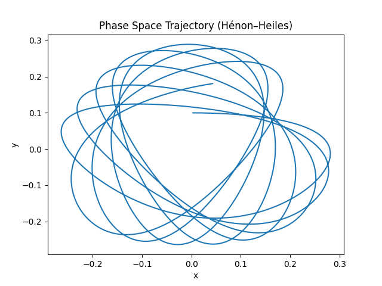
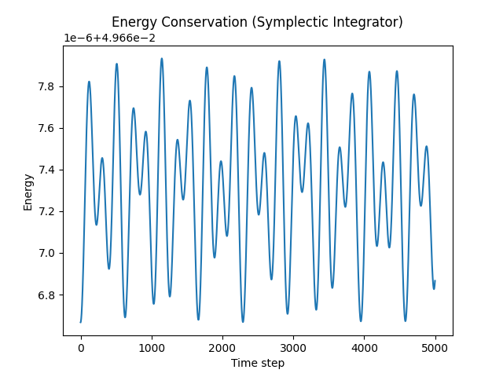

# GPU-Accelerated Symplectic Integrator — Mathematical Documentation

## Overview

This document explains the **mathematical foundations** and **numerical methods** implemented in this project, with a focus on:

* Hamiltonian dynamics
* The Hénon–Heiles system
* Structure-preserving (symplectic) integration
* GPU-parallel execution

The goal is to simulate nonlinear dynamical systems **faithfully over long time horizons**, where naive high-accuracy methods often fail.

---

## 1. Hamiltonian Mechanics

### 1.1 Phase Space

The system evolves in a **4-dimensional phase space**:

[
(q, p) = (x, y, p_x, p_y)
]

* (q = (x, y)): position
* (p = (p_x, p_y)): momentum

#### Phase Space Trajectory



This shows the trajectory in configuration space \((x, y)\). For chaotic regimes, the trajectory explores complex regions of phase space.

---

### 1.2 Hamiltonian Function

The total energy of the system is:

[
H(x,y,p_x,p_y) = T(p) + V(x,y)
]

with:

* Kinetic energy:
  [
  T = \frac{1}{2}(p_x^2 + p_y^2)
  ]

* Potential energy (Hénon–Heiles):
  [
  V(x,y) = \frac{1}{2}(x^2 + y^2) + x^2 y - \frac{1}{3} y^3
  ]

---

### 1.3 Equations of Motion

Hamilton’s equations:

[
\dot{x} = p_x, \quad \dot{y} = p_y
]
[
\dot{p}_x = -\frac{\partial V}{\partial x}, \quad
\dot{p}_y = -\frac{\partial V}{\partial y}
]

---

### 1.4 Gradient of the Potential

[
\frac{\partial V}{\partial x} = x + 2xy
]
[
\frac{\partial V}{\partial y} = y + x^2 - y^2
]

These are computed in the CUDA device function:

```
compute_gradients(x, y, grad_x, grad_y)
```

---

## 2. Geometry of Hamiltonian Systems

Hamiltonian systems have special structure:

### 2.1 Phase Space Flow

```
        p
        ↑
        │        trajectories follow level sets of H
        │     ⟲      ⟲       ⟲
        │   ⟲    ⟲       ⟲
        │ ⟲
        └──────────────→ q
```

* Motion stays on constant-energy surfaces
* Flow is **volume-preserving** (Liouville’s theorem)

---

### 2.2 Key Invariants

* Energy (H) is conserved
* Phase-space volume is conserved
* Trajectories lie on manifolds

---

## 3. Numerical Integration Challenge

Standard methods (e.g., RK4):

* Minimize local truncation error
* **Destroy global structure**

Result:

## Energy Conservation



The symplectic integrator preserves energy up to bounded oscillations, demonstrating long-term stability.


---

## 4. Symplectic Integrator (Leapfrog / Verlet)

### 4.1 Algorithm

The symplectic method splits updates into **half-step momentum and full-step position**:

[
p_{n+1/2} = p_n - \frac{\Delta t}{2} \nabla V(q_n)
]

[
q_{n+1} = q_n + \Delta t , p_{n+1/2}
]

[
p_{n+1} = p_{n+1/2} - \frac{\Delta t}{2} \nabla V(q_{n+1})
]

---

### 4.2 Geometric Interpretation

Instead of approximating the trajectory directly, we approximate the **flow map**:

```
Step splitting:

[Kick] → [Drift] → [Kick]

p ----> p_half ----> p_next
   \        |
    \       |
     \      v
       q --------> q_next
```

---

### 4.3 Why It Works

Symplectic integrators preserve:

* Phase-space structure
* Symplectic 2-form
* Long-term qualitative behavior

---

### 4.4 Energy Behavior

Instead of drifting:

```
Energy vs Time (Symplectic)

E
│   ~~~~~~~~
│  ~        ~
│ ~          ~
│~            ~
└────────────── t
```

Energy error is:

[
H(t) = H(0) + \mathcal{O}(\Delta t^2)
]

but remains **bounded**.

---

## 5. Comparison of Integrators

| Method   | Order | Symplectic | Energy Behavior      | Long-Term Stability |
| -------- | ----- | ---------- | -------------------- | ------------------- |
| Euler    | 1     | ❌          | Diverges             | ❌                   |
| RK4      | 4     | ❌          | Drifts slowly        | ❌                   |
| Leapfrog | 2     | ✅          | Oscillatory, bounded | ✅                   |

---

## 6. CUDA Parallelization Model

### 6.1 Problem Structure

Each trajectory evolves independently:

[
z_i(t) \rightarrow z_i(t + \Delta t)
]

---

### 6.2 GPU Mapping

```
Thread i  →  trajectory i

(x[i], y[i], px[i], py[i])
```

---

### 6.3 Memory Layout

Structure of Arrays (SoA):

```
x:   [x0 x1 x2 x3 ...]
y:   [y0 y1 y2 y3 ...]
px:  [p0 p1 p2 p3 ...]
py:  [p0 p1 p2 p3 ...]
```

Benefits:

* Coalesced memory access
* High bandwidth utilization

---

### 6.4 Kernel Execution

```
integrator_kernel<<<grid, block>>>(...)
```

Each thread performs:

```
for step in time:
    symplectic_update()
```

---

## 7. Energy Diagnostics

Energy is computed as:

[
E_i = \frac{1}{2}(p_x^2 + p_y^2) + V(x,y)
]

Used for:

* Verifying correctness
* Comparing integrators
* Detecting numerical instability

---

## 8. Key Insight

> High-order accuracy is not enough for physical simulation.

* RK4: accurate trajectory locally, wrong globally
* Symplectic: slightly less accurate locally, **correct physics globally**

---

## 9. Extensions

### 9.1 Higher-Order Symplectic Methods

* Yoshida integrators
* Forest–Ruth splitting

---

### 9.2 Advanced Analysis

* Poincaré sections
* Lyapunov exponents
* Chaos detection

---

### 9.3 HPC Extensions

* Mixed precision (FP32/FP64 hybrid)
* Multi-GPU scaling
* Adaptive batching

---

## 10. Summary

This project demonstrates:

* How **Hamiltonian structure** drives algorithm choice
* Why **symplectic integrators are essential**
* How GPUs enable **massively parallel trajectory simulation**

---

## 11. Minimal Conceptual Diagram

```
Hamiltonian System
        ↓
Equations of Motion
        ↓
Discretization Choice
        ↓
 ┌───────────────┬─────────────────┐
 │ Standard ODE  │ Symplectic      │
 │ Methods       │ Integrators     │
 ├───────────────┼─────────────────┤
 │ RK4           │ Leapfrog        │
 │ High accuracy │ Structure-pres. │
 │ Energy drift  │ Energy bounded  │
 └───────────────┴─────────────────┘
        ↓
GPU Parallel Execution
        ↓
Millions of trajectories
```

---

## Final Remark

This codebase is a compact example of a deep principle:

> **Preserving mathematical structure is often more important than minimizing numerical error.**

This is especially true in:

* Computational physics
* Molecular dynamics
* Celestial mechanics
* Long-term dynamical simulations

---
